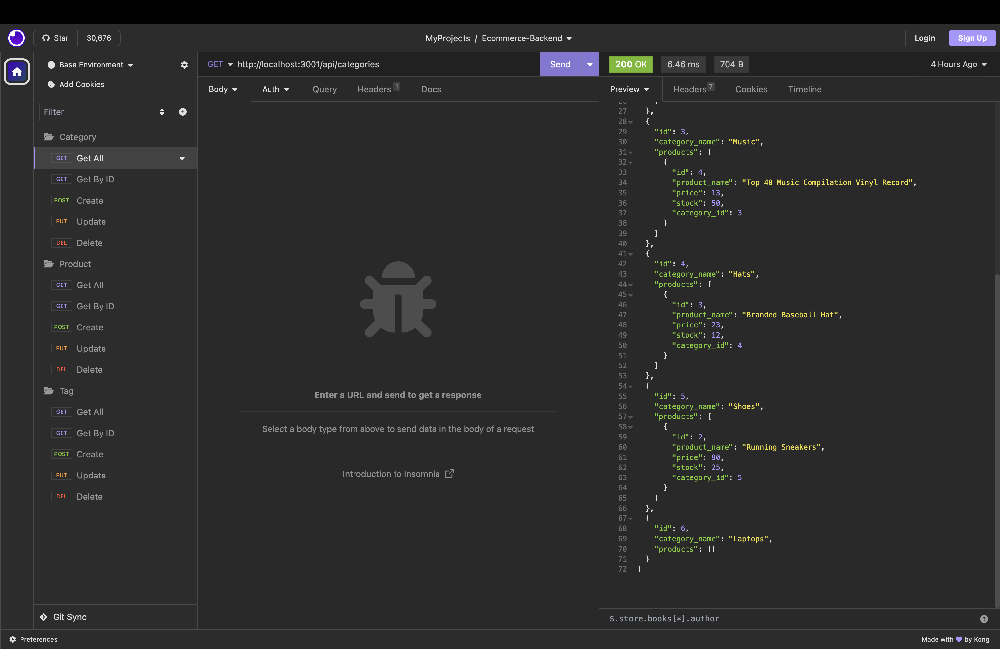

# Lucratively-Electronic
ORM E-commerce Back End

## Table of Contents
* [Description](#description)
* [Installation](#installation)
* [Usage](#usage)
* [License](#license)
* [Contributing](#contributing)
* [Tests](#tests)
* [Questions](#questions)

## Description
Lucratively Electronic provides the back end software for e-commerce companies desiring that competitve edge in the e-commerce market. Utilizing Express.js API, this app incorporates Sequelize to interact with its MySQL database.

## Installation
1. Clone my respository by inputting the following in your terminal:
 
 `git clone https://github.com/Git-BritHub/Lucratively-Electronic.git`

2. When cloning is complete, input `cd Lucratively-Electronic`
3. Next, install the needed package dependencies by running `npm i`
4. Important: make sure to create and set up your .env file for your data base name, MySQL username and password.
5. Once your .env file is created, copy and paste the following into your .env file and fill in your needed MySQL user name and password information inside the single quotes:

     DB_NAME='ecommerce_db'

 

     DB_USER=''

 

     DB_PW=''

 

## Usage
Utilizing Express Front End routing and MySQL database, this application requires MySQL and Node.
 

1. Input `npm run seed` in the repo's main terminal to run the schema.
2. Next, input `npm run seed data` so that data can be added.
3. Lastly, input `npm run start` in your terminal to launch the app.
 

## License

## Contributing
* Recieved company starter code from https://github.com/coding-boot-camp/fantastic-umbrella.git
* Guidance and feedback from U of U Software Developer Tutor -- Jacob Nordan.

## Tests
Performed on macOS with Insomnia
 

## Questions
If you find any bugs or have any questions, feel free to reach out to me through GitHub at https://github.com/Git-BritHub 